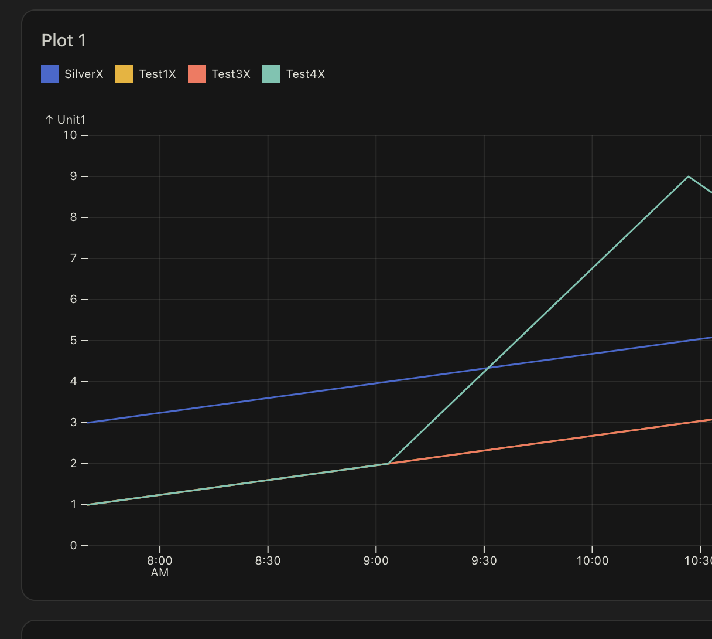
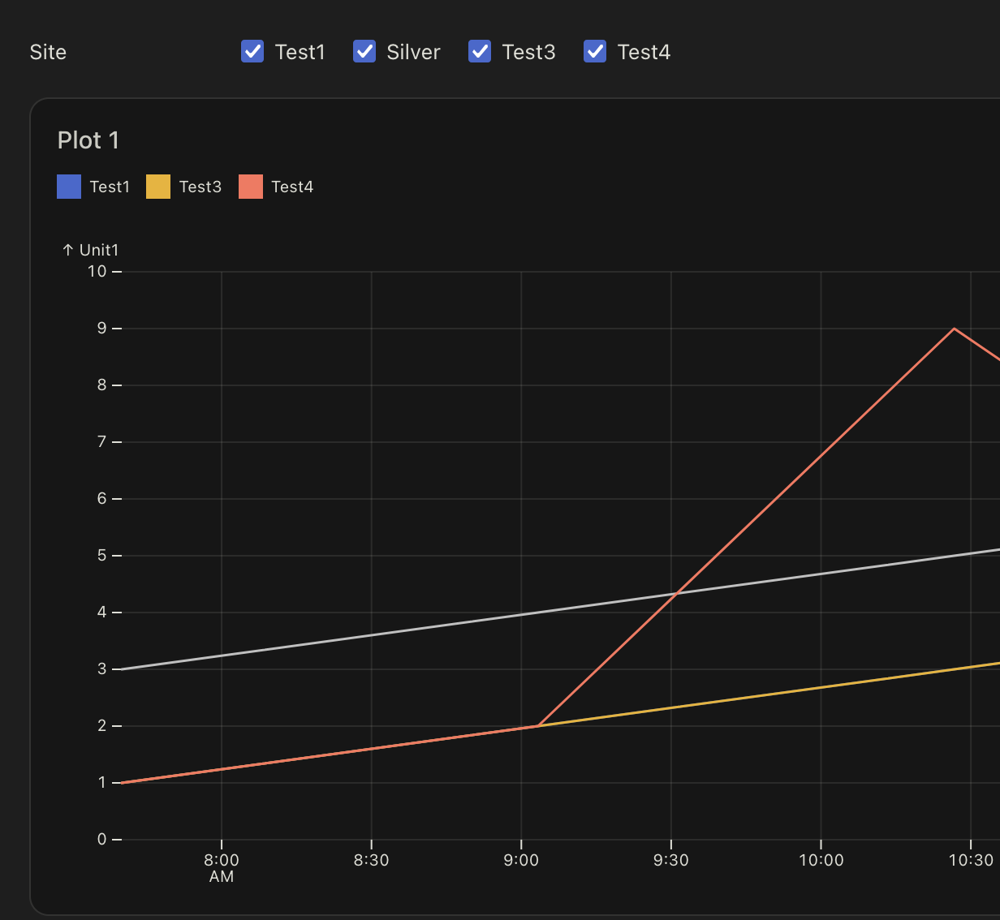

# Radio Repro2

This repo is meant to reproduce a bug.

```
yarn dev
```

Then visit <http://localhost:3000> to preview.

## The bug report

The application is a meant to display several measured parameters at
several sites.  [See the real site](https://noyo-harbor-blue-economy.observablehq.cloud/feasibility-study/).

The problem I stumbled upon happens because a site name, used as a
stroke color in the plot, is also a color name.  Here, I have added an
extra `X` character to each site name via a literal in the SQL query.



When I replace the string `'${sitename}X'` with `${sitename}` in
index.md, the bug can be seen.



## The help request

There is a `Inputs.table(results[0])` expression which displays nothing.
The same data appears to work as a plot. How come?
